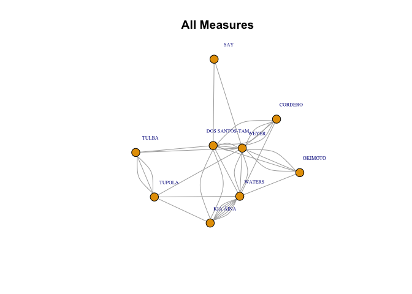

<!-- README.md is generated from README.Rmd. Please edit that file -->

# hnlcouncilR

<!-- badges: start -->
<!-- badges: end -->

The `hnlcouncilR` package provides some helper functions to download
data about Honolulu City Council measures from
<https://hnldoc.ehawaii.gov/hnldoc/measure> and export them in more user
friendly format. It also currently contains one data visualization
function that creates a network graph to show which city council members
co-introduce measures together. More features will be coming over time.
If you have a special request, feel free to create an issue requesting
new features.

## Installation

You can install the development version of hnlcouncilR from
[GitHub](https://github.com/) with:

``` r
# install.packages("pak")
pak::pak("rentzb/hnlcouncilR")
```

## Example

This is a basic example of how to use the package

``` r
library(hnlcouncilR)
# download data about measures
measures_df <- get_council_measures(start_measure = 2796, end_measure = 3162)
# extract more detailed information about the votes
votes_df <- get_votes(measures_df)
# visualize the co-introductions
cointro_network_graph(measures_df, type = "all")
```


